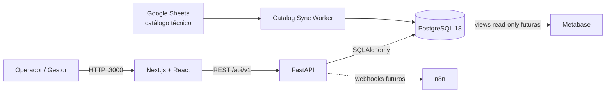
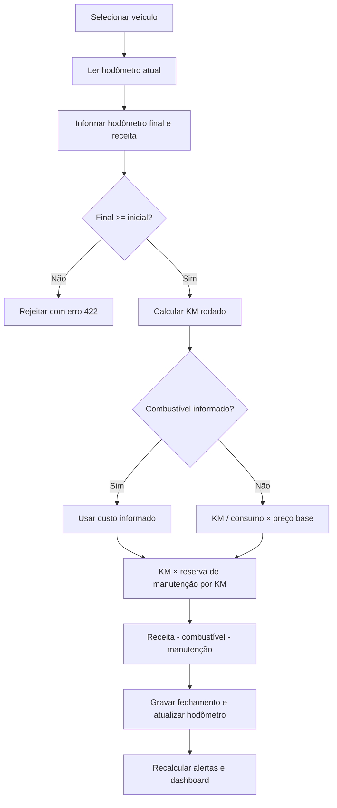

# Logística 360 — Gestão Operacional e Financeira

Plataforma web conteinerizada para controlar veículos, fechamentos diários, custos, manutenção preventiva e **lucro líquido real por quilômetro**. O mesmo domínio atende uma moto de delivery, carros de serviço, ônibus e frotas pesadas.

## O que já funciona

- Dashboard executivo com KPIs e gráficos de gastos por dia, semana e mês.
- Páginas independentes para Dashboard, Catálogo, Financeiro e Frota.
- Catálogo técnico sincronizado com Google Sheets e cadastro de veículos.
- Fechamento diário com hodômetros inicial/final, idempotência e validação contra regressão.
- Cálculo automático de combustível e rateio de manutenção por quilômetro.
- Regras, histórico, alertas preventivos e ficha financeira por veículo.

## Stack

| Camada | Tecnologia |
|---|---|
| Interface | Next.js 16, React 19, TypeScript e Tailwind CSS 4 |
| API | Python, FastAPI, Pydantic e SQLAlchemy 2 |
| Banco | PostgreSQL 18 e Alembic |
| Integração | Google Sheets e worker de sincronização |
| Infraestrutura | Docker Compose e health checks |
| Qualidade | pytest, Ruff, mypy e build TypeScript |
| Engenharia | Spec Kit, especificações e harness de agentes |

## Arquitetura



A API é a única camada autorizada a alterar dados de domínio. DBeaver é administrativo, e integrações como n8n devem usar endpoints autenticados.

## Fluxo do fechamento



## Estrutura

```text
backend/           API, domínio, migrations e testes
frontend/          aplicação Next.js, páginas e componentes
docs/              arquitetura, fluxos e guias operacionais
specs/             especificação, plano e tarefas
spec-kit/          ferramenta de especificação dirigida
workflows/         grafo/harness dos agentes
docker-compose.yml ambiente completo
.env.example       configuração local sem segredos
```

Consulte o [índice da documentação](docs/README.md) e a [arquitetura detalhada](docs/architecture.md).

## Executar localmente

Pré-requisito: Docker Desktop com Docker Compose.

```powershell
git clone --recurse-submodules https://github.com/ArthurDays/sistema-gestao-logistica.git
Set-Location sistema-gestao-logistica
Copy-Item .env.example .env
docker compose up -d --build
docker compose ps
```

Se o repositório já tiver sido clonado sem submódulos, execute `git submodule update --init --recursive`.

| Serviço | Endereço |
|---|---|
| Dashboard | http://localhost:3000 |
| Catálogo | http://localhost:3000/catalogo |
| Financeiro | http://localhost:3000/financeiro |
| Frota | http://localhost:3000/frota |
| API / OpenAPI | http://localhost:8000 / http://localhost:8000/docs |
| PostgreSQL / DBeaver | `localhost:5432` |

Os valores de `.env.example` são somente para desenvolvimento.

## Validar

```powershell
docker compose --profile test run --rm api-tests
docker compose build frontend
docker compose up -d --wait
```

## Regras centrais

```text
distância = hodômetro final - hodômetro inicial
combustível automático = (distância / consumo médio) × preço base
manutenção apropriada = distância × custo de manutenção por km
lucro líquido real = receita bruta - combustível - manutenção apropriada
```

- Dinheiro usa `Decimal`/`NUMERIC`, nunca ponto flutuante.
- O hodômetro final não pode ser menor que o atual.
- Escritas repetíveis usam `Idempotency-Key`.
- Mudanças de schema usam migrations Alembic.

## Documentação

- [Arquitetura e containers](docs/architecture.md)
- [Fluxos operacionais](docs/operational-flows.md)
- [Modelo de dados](docs/data-model.md)
- [API e integrações](docs/api-and-integrations.md)
- [Graph Engineering e agentes](docs/agent-harness.md)
- [Como contribuir](CONTRIBUTING.md)
- [Especificação integrada Specsfy 2.0](specs/completed/0001-gestao-logistica/spec.md)

### Painel Specsfy no VS Code

Com o projeto aberto no VS Code, pressione `Ctrl+Shift+B` ou execute **Terminal → Executar Tarefa → Specsfy: abrir painel**. O task versionado em `.vscode/tasks.json` executa:

```powershell
specsfy tui --project .
```

Para sair do painel, pressione `Ctrl+Q` ou `Ctrl+C` no terminal.

## Estado

MVP em evolução. Autenticação, isolamento completo por organização, outbox/webhooks n8n, observabilidade e produção permanecem no roadmap.
