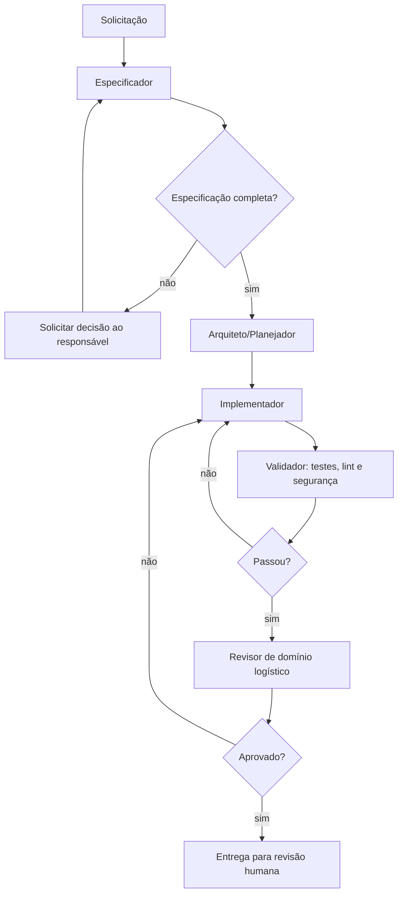

# Graph Engineering e Harness de Agentes

## Propósito

O **Spec Kit é o harness principal** para a construção e manutenção do software. Ele orquestra o processo por especificação, planejamento, tarefas, implementação e validação. Este documento complementa o Spec Kit com regras de domínio logístico, critérios de qualidade e limites de autorização.

O harness não executa lançamentos financeiros nem toma decisões operacionais sem autorização humana. Os agentes trabalham sobre tarefas limitadas, com evidência verificável e permissões mínimas.

## Arquitetura do grafo



## Nós do grafo

| Nó | Responsabilidade | Pode escrever código? | Saída obrigatória |
|---|---|---:|---|
| Especificador | Converter pedido em histórias, requisitos e critérios de aceite | Não | `spec.md` atualizado |
| Arquiteto | Produzir plano, modelo de dados e contratos | Não | `plan.md` e decisões registradas |
| Implementador | Executar tarefas pequenas e testáveis | Sim, no escopo aprovado | Código, migration e testes |
| Validador | Rodar testes, lint, tipagem e checagens de segurança | Não | Evidências e falhas reproduzíveis |
| Revisor de domínio | Conferir cálculo financeiro, KM, manutenção e idempotência | Não | Parecer de aceite |
| Operador de infraestrutura | Alterar Compose, CI, n8n e observabilidade | Sim, após aprovação | Arquivo de infra e validação |

## Regras não negociáveis

1. Nenhum agente altera produção, segredos, banco produtivo ou workflow n8n ativo sem aprovação humana explícita.
2. Todo agente recebe apenas o contexto mínimo necessário e uma tarefa com critério de saída.
3. O implementador não altera a especificação para fazer o código passar; divergências retornam ao especificador.
4. Alterações de banco exigem migration Alembic, teste de migração e plano de reversão.
5. Todo cálculo financeiro deve usar `Decimal` e ter teste de cenário de negócio.
6. Comandos destrutivos, rede, publicação, `git push` e deploy permanecem sob aprovação explícita.
7. Uma tarefa só é concluída quando os comandos de validação forem executados e seus resultados registrados.

## Comandos padronizados

| Objetivo | Comando/fluxo | Condição de saída |
|---|---|---|
| Criar requisito | Spec Kit: especificar → esclarecer | Critérios Given/When/Then completos |
| Planejar mudança | Spec Kit: planejar → tarefas | Dependências e riscos explícitos |
| Implementar | Executar uma tarefa por vez | Código e testes locais prontos |
| Validar backend | `pytest`, `ruff check`, `mypy` | Todos aprovados |
| Validar frontend | `npm run lint`, `npm run test`, `npm run build` | Todos aprovados |
| Validar banco | `alembic upgrade head` em banco descartável | Schema aplicável do zero |
| Validar containers | `docker compose up -d` + health checks | Serviços saudáveis |

## Implementação do grafo

O grafo é executado por um workflow do Spec Kit localizado em `workflows/logistics-delivery/workflow.yml`. O workflow usa comandos do Spec Kit para gerar especificação, plano, tarefas, análise e implementação, interrompendo em gates de revisão humana.

Para habilitá-lo após inicializar o projeto com a CLI do Spec Kit:

```powershell
specify workflow add --dev workflows/logistics-delivery
specify workflow run logistics-delivery -i spec="<solicitação>"
```

Não há dependência de LangGraph no MVP. LangGraph somente será avaliado se o **produto final** precisar oferecer agentes de IA aos seus usuários, o que está fora do escopo atual.

## Métricas do harness

- Taxa de tarefas aceitas sem retrabalho.
- Tempo entre especificação aprovada e validação concluída.
- Número de falhas detectadas antes da revisão humana.
- Número de ações bloqueadas por política.
