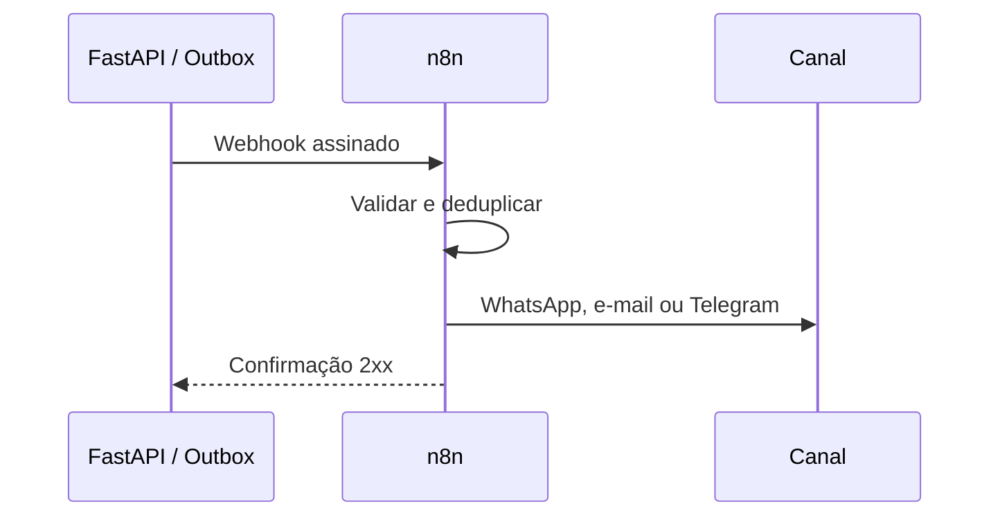

# API e integrações

A documentação OpenAPI fica em `http://localhost:8000/docs`.

| Método | Endpoint | Uso |
|---|---|---|
| GET | `/health` | Health check |
| GET/POST | `/api/v1/vehicles` | Veículos |
| POST | `/api/v1/vehicles/{id}/operations` | Fechamento diário |
| GET | `/api/v1/vehicles/{id}/profitability` | Rentabilidade |
| GET | `/api/v1/dashboard/monthly-summary` | KPIs mensais |
| GET | `/api/v1/dashboard/expense-sampling` | Dia/semana/mês |
| GET | `/api/v1/vehicle-catalog` | Catálogo técnico |
| POST | `/api/v1/vehicle-catalog/sync` | Sincronizar planilha |
| POST | `/api/v1/vehicle-catalog/{id}/register` | Cadastrar pelo catálogo |
| GET/POST | `/api/v1/maintenance-rules` | Regras preventivas |
| GET | `/api/v1/maintenance-alerts` | Alertas abertos |

## Idempotência

`POST /vehicles/{id}/operations` exige `Idempotency-Key`. Repetir a chave retorna o registro existente sem duplicar receita, custo ou quilometragem.

## Google Sheets

O worker `catalog-sync` consulta `VEHICLE_CATALOG_CSV_URL`, normaliza valores e faz upsert no catálogo. A página Catálogo também permite sincronização manual.

## n8n — fluxo planejado

Antes da produção: autenticação de serviço, HMAC, outbox, retentativa com backoff e fila de mensagens mortas. O n8n não recebe credenciais de escrita do PostgreSQL.
