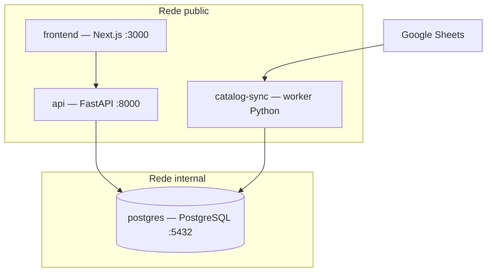
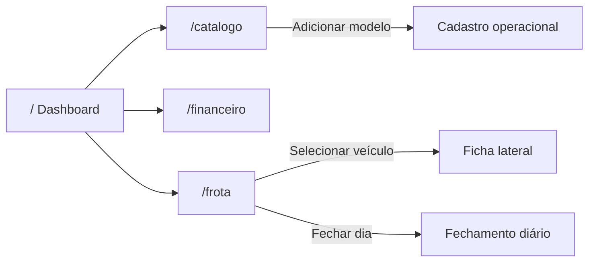
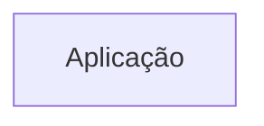
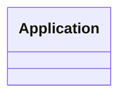

# Arquitetura do sistema

O MVP é um monólito modular com Next.js para apresentação, FastAPI para domínio/API e PostgreSQL como fonte de verdade. Um worker separado sincroniza o catálogo técnico.

## Responsabilidades

| Componente | Responsabilidade | Não deve fazer |
|---|---|---|
| Frontend | Visualização, interação e validação de experiência | Ser fonte de verdade financeira |
| API | Validar comandos, executar regras e transações | Depender de estado do navegador |
| PostgreSQL | Integridade relacional e persistência | Ser alterado manualmente em produção |
| Catalog worker | Ler e normalizar a planilha | Alterar veículos operacionais existentes |
| n8n (roadmap) | Coleta e notificações via API/webhook | Escrever diretamente no banco |

## Princípios

1. A API é a fronteira transacional.
2. Dinheiro usa precisão decimal de ponta a ponta.
3. Hodômetro é monotônico e atualizado na transação do fechamento.
4. Integrações repetíveis são idempotentes.
5. O catálogo é referência técnica; o veículo mantém estado operacional próprio.
6. Cada mudança no banco possui migration versionada.

## Navegação

## Evolução prevista

- Autenticação e autorização por organização.
- Outbox transacional para eventos e webhooks n8n.
- Metabase com usuário e views somente leitura.
- Redis/fila somente quando métricas justificarem.
- Proxy TLS, backups e observabilidade para produção.

<!-- specsfy:documentator:start -->
## Componentes

| Tipo | Quantidade |
| --- | --- |
| Código | 85 |
| Testes | 0 |

## Diagramas

<!-- specsfy:documentator:end -->
