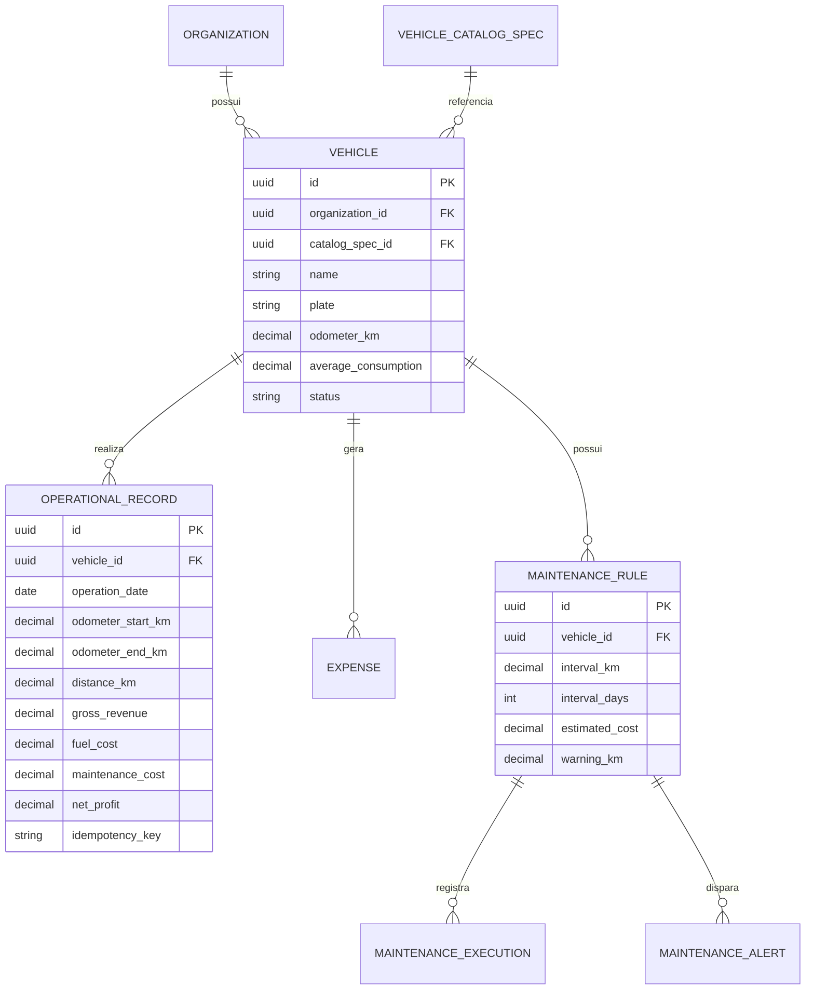

# Modelo de dados

## Invariantes

- `odometer_end_km >= vehicle.odometer_km`.
- `distance_km = odometer_end_km - odometer_start_km`.
- Valores monetários e métricos são `NUMERIC`/`Decimal`.
- A chave de idempotência impede duplicidade de fechamento.
- Registros preservam custos históricos; mudanças na base não reescrevem o passado.

## Migrations

`backend/alembic/versions/` é a trilha oficial do schema. Não substitua migrations por alterações manuais no DBeaver.
