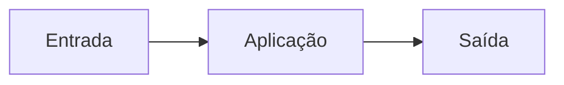
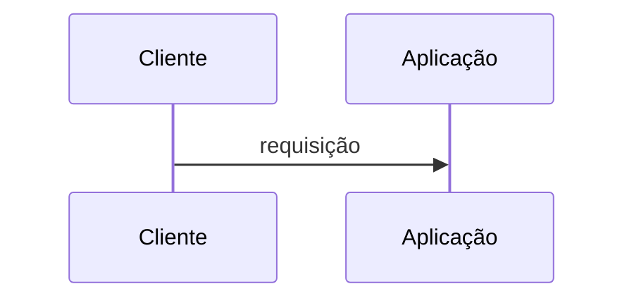
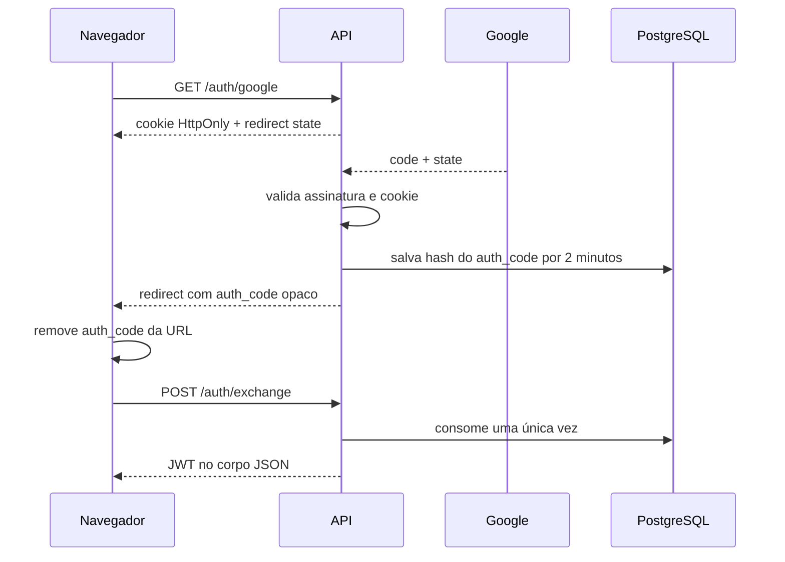
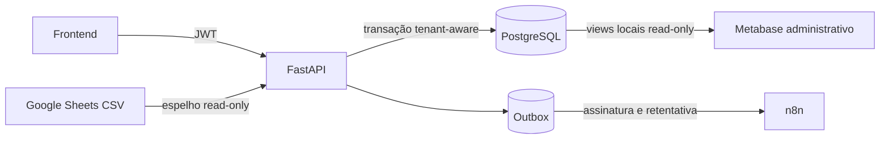

# Fluxos

<!-- specsfy:documentator:start -->
## Fluxo principal

```mermaid
flowchart LR
  Entrada --> Aplicação --> Saída
```

```mermaid
sequenceDiagram
  participant Cliente
  participant Aplicação
  Cliente->>Aplicação: requisição
```
<!-- specsfy:documentator:end -->

## Fluxo confirmado de OAuth

```mermaid
sequenceDiagram
  participant B as Navegador
  participant A as API
  participant G as Google
  participant D as PostgreSQL
  B->>A: GET /auth/google
  A-->>B: cookie HttpOnly + redirect state
  G-->>A: code + state
  A->>A: valida assinatura e cookie
  A->>D: salva hash do auth_code por 2 minutos
  A-->>B: redirect com auth_code opaco
  B->>B: remove auth_code da URL
  B->>A: POST /auth/exchange
  A->>D: consome uma única vez
  A-->>B: JWT no corpo JSON
```

## Fluxo confirmado de escrita

```mermaid
flowchart LR
  UI[Frontend] -->|JWT| API[FastAPI]
  API -->|transação tenant-aware| DB[(PostgreSQL)]
  API --> OUT[(Outbox)]
  OUT -->|assinatura e retentativa| N8N[n8n]
  SHEET[Google Sheets CSV] -->|espelho read-only| API
  DB -->|views locais read-only| BI[Metabase administrativo]
```
