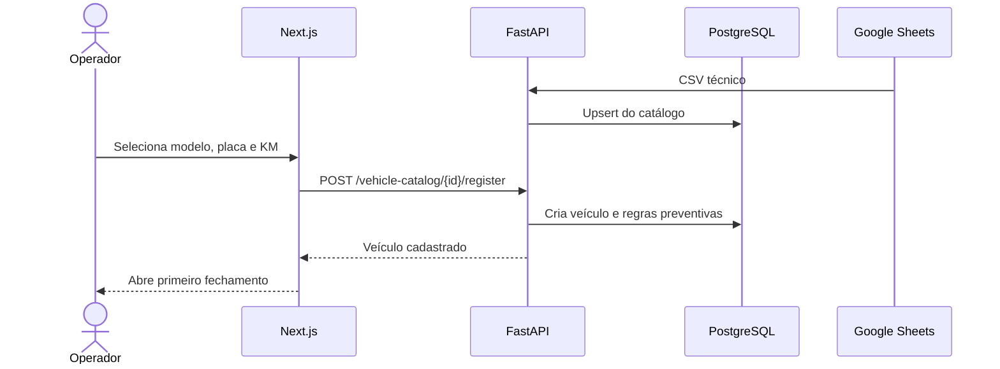
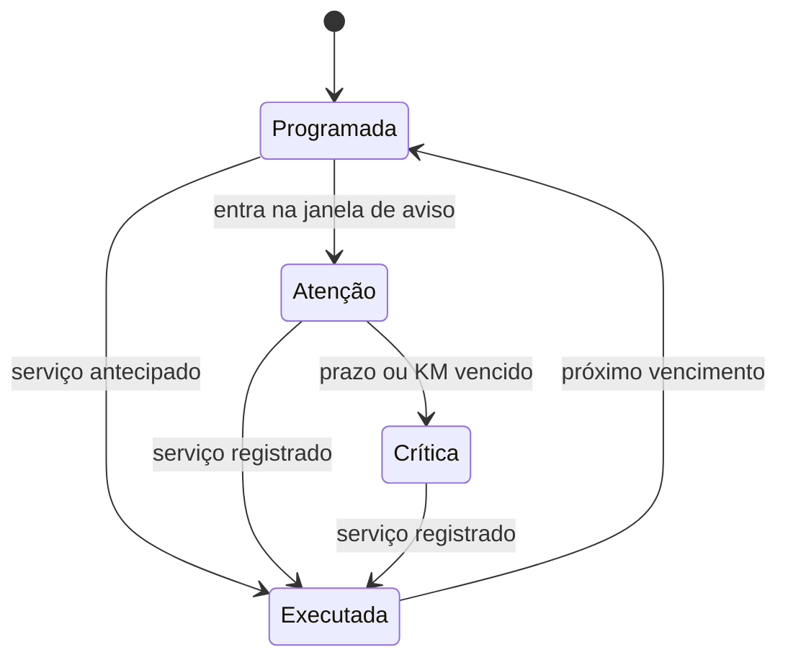

# Fluxos operacionais

## Cadastro pelo catálogo

## Fechamento diário

1. O frontend seleciona um veículo ativo e exibe o hodômetro inicial somente para leitura.
2. O operador informa hodômetro final, receita e opcionalmente combustível.
3. A API bloqueia o veículo, valida progressão e calcula distância/custos.
4. Operação e novo hodômetro são persistidos na mesma transação.
5. O dashboard recarrega os agregados.

## Manutenção preventiva

Alertas a menos de 500 km são urgentes. Registrar uma execução encerra o ciclo atual e estabelece a nova referência.

## Páginas

| Página | Decisão suportada |
|---|---|
| Dashboard | Resultado e saúde da operação |
| Financeiro | Composição dos custos por período |
| Frota | Veículo, hodômetro e manutenção |
| Catálogo | Referência técnica e cadastro |
